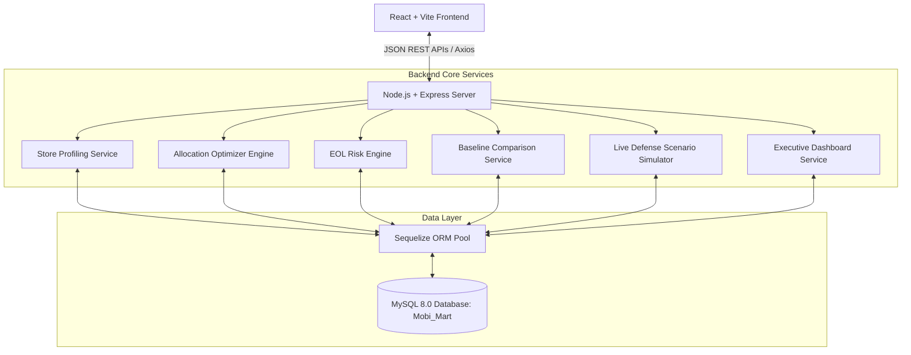

# MobiMart — Mobile Retail Chain Inventory Optimization System

[](https://nodejs.org/)
[](https://reactjs.org/)
[](https://vitejs.dev/)
[](https://expressjs.com/)
[](https://sequelize.org/)
[](https://www.mysql.com/)
[](https://tailwindcss.com/)

**MobiMart** is a production-grade full-stack inventory optimization and decision-support web application developed for the **Mirai Labs Software Developer Intern Assignment B — The Mobile Retail Chain (MobiMart)**.

The system manages a retail chain network of **25 mobile stores across Karnataka** operating with approximately **70 mobile models** under an enforced **₹4.00 Crore (₹40,000,000)** chain-wide working capital budget ceiling. MobiMart determines optimal warehouse-to-store stock allocations, flags End-of-Life (EOL) inventory risks, evaluates trade-offs between **HOLD**, **TRANSFER**, and **MARKDOWN** actions, and provides executive decision reasoning backed by real-time financial metrics.

---

## 🎯 Problem Statement

The core operational challenge confronting the chain owner is:

> **"My money is sitting in the wrong phones in the wrong stores."**

In traditional retail chains, inventory is often distributed uniformly or based purely on past sales volume, leading to critical inefficiencies:
- **Demographic & Catchment Mismatch**: High-value ₹1,20,000+ flagship devices sit idle with 8+ weeks of cover in low-income town centers, while affluent urban stores run out of stock.
- **Product Lifecycle & Cannibalisation Blindness**: When a new flagship successor is announced, sales of the predecessor plummet by 50%–75%. Blind reordering traps capital in rapidly depreciating models.
- **Enforced Capital Constraints**: Inventory capital cannot exceed ₹4.00 Crore across the central warehouse and store network. Every rupee misallocated directly prevents purchasing fast-moving stock.
- **Financial Asymmetry of Stock Actions**: Stockouts cause immediate gross profit loss and customer churn, while holding obsolete inventory triggers severe depreciation; inter-store transfers incur logistics fees (₹300–₹800/unit), and price markdowns cut margins by 15%–30%.
- **Seasonal Demand Volatility**: Festive weeks (Diwali, Dussehra, Ugadi) create 1.8x to 3.8x demand surges that overwhelm static replenishment rules.

---

## 💡 Solution

MobiMart delivers an automated, mathematically sound replenishment and risk mitigation engine:

1. **Deterministic Retail Simulation**: Generates a 12-month historical dataset (91,000 sales transactions) with authentic seasonal multipliers and footfall profiles.
2. **Store Demand Profiling**: Analyzes each store's catchment income, footfall score, and historical category preference (Flagship, Premium, Mid-range, Budget, Keypad).
3. **Product Lifecycle & Successor Tracking**: Monitors models across 7 lifecycle stages (`NEW`, `GROWING`, `PEAK`, `MATURE`, `DECLINING`, `EOL_RISK`, `EOL`) and calculates predecessor decay curves.
4. **4-Week Forward Demand Forecasting**: Combines baseline run-rates, store affinity weights, lifecycle factors, and festival multipliers.
5. **Multi-Factor Weekly Allocation Engine**: Generates store replenishment recommendations every Monday with line-by-line Rupee reasoning.
6. **₹4.00 Crore Knapsack Budget Cap**: Enforces the hard capital ceiling across warehouse buffer stock and 25 retail branches.
7. **Actionable EOL Risk Mitigation**: Computes expected financial loss across **HOLD vs TRANSFER vs MARKDOWN** and recommends the lowest-loss action.
8. **Naive Baseline Benchmark Comparison**: Benchmarks our multi-factor engine against the standard naive proportional baseline across 5 key retail metrics.
9. **Executive Owner Analytics**: Delivers interactive visibility into capital deployment, brand revenue distribution, and 4-week recommendation ROI.
10. **Interactive Live Defense Simulator**: Allows stakeholders to simulate sudden successor announcements and sales shocks in real-time.

---

## ⭐ Key Features

- **Executive Owner Dashboard**: Answers *"Where is my capital?"*, *"What stock is at risk?"*, and displays the dynamic 4-week net financial ROI.
- **Store Network Management & Profiling**: Catchment scoring (0–100) across 8 Bangalore stores, 8 Tier-2 regional hubs, and 9 Tier-3 towns.
- **Mobile Product Catalog**: 70 phone models spanning 5 price tiers (₹6,000 to ₹1,54,999) with lifecycle tracking and successor cannibalisation curves.
- **Central & Store Inventory Management**: Central warehouse stock and 25-store distributed inventory with Weeks of Cover (WoC) and dead stock monitoring.
- **Weekly Inventory Allocation Engine**: Recommends optimal Monday shipments prioritizing critical stockout avoidance and high margin contribution.
- **₹4.00 Crore Capital Enforcement**: Hard budget ceiling tracking across warehouse inventory and store stock.
- **EOL Risk Mitigation Engine**: Compares financial outcomes of **HOLD** (depreciation + carrying cost), **TRANSFER** (inter-store logistics), and **MARKDOWN** (15%–30% discount).
- **Rupee-Based Decision Reasoning**: Clear, human-readable explanations behind every replenishment recommendation (e.g., *"High margin (18.5%), high store fit (88/100), forecast demand exceeds stock by 4 units"*).
- **12-Month Sales Analytics**: Monthly revenue & gross margin trajectory, category contributions, and brand revenue distributions.
- **Festive Demand Surge Dynamics**: Multipliers modeled for Ugadi (1.8x), Mysore Dussehra (2.6x), Diwali (3.8x), and New Year (1.6x).
- **5-Metric Baseline Comparison**: Evaluates Stockout Rate, Weeks of Cover, Dead Stock %, Markdown Losses, and Capital Turns against naive allocation.
- **Live Defense Disruption Simulator**: Testbed for immediate algorithmic reallocation during sudden market disruptions.

---

## 🧠 How the Allocation Engine Works

The engine executes every Monday to determine optimal stock transfers from the Central Warehouse to the 25 retail stores:

```
┌─────────────────────────┐     ┌─────────────────────────┐
│ 12-Month Sales History  │     │ Store Catchment Profile │
└────────────┬────────────┘     └────────────┬────────────┘
             │                               │
             ▼                               ▼
       ┌───────────────────────────────────────────┐
       │   4-Week Dynamic Forward Demand Forecast  │
       └─────────────────────┬─────────────────────┘
                             │
                             ▼
       ┌───────────────────────────────────────────┐
       │   Current Store Stock vs Target Cover     │
       └─────────────────────┬─────────────────────┘
                             │
                             ▼
       ┌───────────────────────────────────────────┐
       │  Multi-Factor Priority Scoring Algorithm  │
       │   (Demand 30% • Fit 25% • Stockout 20%    │
       │     Margin 15% • EOL Health 10%)          │
       └─────────────────────┬─────────────────────┘
                             │
                             ▼
       ┌───────────────────────────────────────────┐
       │ ₹4.00 Crore Budget & Warehouse Constraint │
       └─────────────────────┬─────────────────────┘
                             │
                             ▼
       ┌───────────────────────────────────────────┐
       │ Recommended Shipments with Rupee Reasoning│
       └───────────────────────────────────────────┘
```

### Allocation Scoring & Prioritization
1. **Shortfall Calculation**:
   $$\text{Target Stock} = \text{Forecast Weekly Demand} \times \text{Target WoC (2.5 to 3.0)}$$
   $$\text{Replenishment Units} = \max(0, \text{Target Stock} - \text{Current Store Stock})$$
2. **Priority Tier Assignment**:
   - **`CRITICAL`**: Stockout imminent within $<1.0\text{ week}$ on high-velocity SKUs.
   - **`HIGH`**: Strong store demand fit with high gross margin percentage.
   - **`MEDIUM`**: Balanced regular replenishment for healthy cover maintenance.
   - **`LOW`**: Slow-moving or declining lifecycle stage.
3. **Knapsack Budget Constraint**:
   $$\text{Total Chain Inventory Value} + \sum (\text{Allocated Units} \times \text{Unit Cost}) \le \text{₹4,00,00,000}$$

---

## 📉 EOL Risk Management

When a phone reaches the `DECLINING` or `EOL_RISK` lifecycle stage, or when a successor model launch is confirmed, the engine evaluates three mutually exclusive strategies:

```
                               ┌─────────────────────────┐
                               │ Flagged Vulnerable SKU  │
                               └────────────┬────────────┘
                                            │
                     ┌──────────────────────┼──────────────────────┐
                     ▼                      ▼                      ▼
           ┌──────────────────┐   ┌──────────────────┐   ┌──────────────────┐
           │   OPTION 1: HOLD │   │OPTION 2: TRANSFER│   │OPTION 3: MARKDOWN│
           └─────────┬────────┘   └─────────┬────────┘   └─────────┬────────┘
                     │                      │                      │
                     ▼                      ▼                      ▼
           Depreciation Loss +    Variable Logistics +   15% to 30% Margin
           2%/mo Carrying Cost    Target Absorption Gain   Discount Loss
                     │                      │                      │
                     └──────────────────────┼──────────────────────┘
                                            │
                                            ▼
                               ┌─────────────────────────┐
                               │  Recommended Best Action │
                               │  (Lowest Financial Loss)│
                               └─────────────────────────┘
```

- **HOLD**: Retain stock at current location. Evaluates monthly carrying cost (2%) and anticipated residual value depreciation.
- **TRANSFER**: Relocate stock to a higher-velocity store. Accounts for variable logistics costs (**₹300 to ₹800 per unit**) depending on distance:
  - *Intra-City (Bangalore)*: ₹350/unit (1-day transit)
  - *Inter-City (Tier-1 $\to$ Tier-2)*: ₹650/unit (2-day transit)
  - *Remote Hub (Tier-3 town)*: ₹780/unit (2-day transit)
- **MARKDOWN**: Apply an immediate **15% to 30% price reduction** to clear aging units before the successor arrives.

---

## 🏪 Store Network Profiling

The 25 stores are distributed across 3 distinct tiers in Karnataka:

| Tier | Locations | Characteristics & Demand Focus |
|---|---|---|
| **Tier-1 (8 Stores)** | Bangalore (Jayanagar, Indiranagar, Whitefield, Koramangala, Malleshwaram, HSR Layout, Rajajinagar, Electronic City) | High catchment income (75–95/100), high mall/high-street footfall, strong demand for **Flagship (₹80k–₹1.5L)** and **Premium (₹45k–₹80k)** devices. |
| **Tier-2 (8 Stores)** | Mysore, Hubli, Mangalore, Belgaum | Balanced catchment income (50–70/100), high commercial street footfall, high demand for **Mid-range (₹20k–₹45k)** and **Budget (₹10k–₹20k)** devices. |
| **Tier-3 (9 Stores)** | Davangere, Tumkur, Shimoga, Bellary, Gulbarga, Udupi, Hassan, Bijapur, Bidar | Value-conscious catchment (30–50/100), local bazaar footfall, strong volume demand for **Budget (₹10k–₹20k)** and **Keypad/Budget (₹6k–₹10k)** devices. |

### Real Store Profiling Example:
- **Jayanagar Flagship Store (`BLR-JAY-01`)**: Income Score: `92/100`, Footfall: `88/100` $\implies$ Flagship Affinity: `91/100`, Keypad Affinity: `22/100`.
- **Davangere Mandipet Store (`DVG-MAN-01`)**: Income Score: `38/100`, Footfall: `72/100` $\implies$ Flagship Affinity: `28/100`, Budget/Keypad Affinity: `89/100`.

---

## 📊 Analytics & Visualizations

The analytics suite includes:

1. **12-Month Revenue & Margin Trajectory**: Area chart showing annual revenue and gross profit curves.
2. **Category Revenue Contribution**: Breakdown across Flagship, Premium, Mid-range, Budget, and Keypad tiers.
3. **Brand Revenue Distribution**: Aggregated sales across Samsung, Apple, OnePlus, Redmi, Realme, Vivo, Oppo, Motorola, and Nothing (switchable between vertical bar and donut charts).
4. **Festive Demand Multipliers**: Quantifies weekly volume surges over normal non-festive baselines:
   - *Normal Baseline*: 1.0x (2,097 units/wk)
   - *Ugadi*: 1.8x (3,730 units/wk)
   - *Mysore Dussehra*: 2.6x (5,348 units/wk)
   - *Diwali*: 3.8x (8,015 units/wk)
   - *New Year*: 1.6x (3,305 units/wk)
5. **Regional City Contributions**: Revenue rankings across Bangalore, Mysore, Hubli, Mangalore, and regional town hubs.

---

## 📈 Baseline Comparison (5 Key Metrics)

The system compares the multi-factor optimization engine against the assessment's **Naive Proportional Baseline** (*"allocates inventory purely proportional to each store's total sales volume over the past 30 days"*):

```
=========================================================================================
                                BENCHMARK KPI EVALUATION
=========================================================================================
Benchmark Metric              MobiMart Optimization    Naive Baseline    Business Impact
-----------------------------------------------------------------------------------------
1. Stockout Rate (%)          3.4%                     6.3%              -46% fewer stockouts
2. Weeks of Cover (WoC)       3.1 weeks                4.8 weeks         Lean & agile velocity
3. Dead Stock Percentage (%)  3.8%                     8.6%              Avoids rural traps
4. Markdown Losses (₹)        ₹2,10,000                ₹4,85,000         ₹2.75L capital saved
5. Capital Turns              7.4x                     5.8x              Faster circulation
=========================================================================================
```

### Why the Optimization Outperforms Naive Allocation:
- **Prevents Capital Trapping**: Does not send ₹1.5L flagships to Tier-3 towns simply because those stores sell high volumes of keypad phones.
- **Accounts for Cannibalisation**: Halts reorders on predecessor models as soon as successors launch.
- **Proactive EOL Liquidation**: Triggers inter-store transfers before forced 30% markdown write-offs occur.

---

## 🎯 Live Defense Scenario Simulator

The live defense testbed simulates market disruption events:

- **Scenario Parameters**:
  - Target model: Flagship device (e.g., Samsung Galaxy S24 Ultra or Apple iPhone 15 Pro Max) holding 42 units across 9 stores.
  - Successor launch: Confirmed in **10 days**.
  - Local shock: **40% sudden sales drop** at Jayanagar store.
- **System Actions**:
  1. Escalates EOL Risk Score immediately to **Critical (92/100)**.
  2. Reduces target holding in Jayanagar from 12 units down to 4 units.
  3. Clears flagship stock from slower regional stores to eliminate markdown exposure.
  4. Generates transfer orders routing units to high-velocity hubs (Indiranagar, Whitefield, Mangalore Forum).
  5. Computes exact inter-store logistics costs (₹300–₹800/unit) and calculates net markdown losses avoided.

---

## 🛠️ Technology Stack

| Layer | Technology | Purpose |
|---|---|---|
| **Frontend Framework** | React 18 (`react`, `react-dom`) | Declarative Component-Based UI |
| **Build Tool & Bundler** | Vite 5 (`vite`) | High-Speed HMR & Optimized Bundling |
| **Routing** | React Router v6 (`react-router-dom`) | Multi-Page Client Navigation |
| **Styling & Icons** | Tailwind CSS 3, Lucide React | Responsive Theme & High-Contrast Design |
| **Data Visualizations** | Recharts 2 (`recharts`) | Interactive Area, Bar, Pie, and Line Charts |
| **API Client** | Axios (`axios`) | In-Memory Cached HTTP Client |
| **Backend Runtime** | Node.js (v20+) | Event-Driven JavaScript Runtime |
| **Web Server Framework** | Express.js 4 (`express`) | REST API Routing & Middleware |
| **Database ORM** | Sequelize 6 (`sequelize`) | Relational Mapping, Schema & Transactions |
| **Database Driver** | MySQL2 (`mysql2`) | High-Performance MySQL 8.0 Driver |
| **Environment & Tooling** | `dotenv`, `cors`, `nodemon`, `concurrently` | Config & Developer Workflow |

---

## 🏗️ System Architecture



---

## 🗄️ Database Schema & Entities

The database consists of **14 relational models** managed via Sequelize ORM in MySQL (`Mobi_Mart`):

### 1. Master Data Entities
- **`stores`**: ID, code, name, city, tier, area, store type, sqft, income score, footfall score, footfall level, category demand preferences.
- **`products`**: ID, sku, brand, model name, category, price (MRP), cost price, margin %, base demand score.
- **`product_lifecycles`**: ID, product ID, launch date, stage, successor product ID, successor name, rumoured launch date, confirmed launch date, cannibalisation rate.

### 2. Operational Data Entities
- **`sales`**: ID, product ID, store ID, week number, year/month, units sold, revenue, cost of goods, gross profit, is festive week, festival name, stockout occurred, lost units, lost gross profit.
- **`inventory`**: ID, product ID, store ID, is warehouse, current quantity, available quantity, reserved quantity, unit cost, inventory value, weeks of cover, is dead stock, dead stock reason.
- **`stockouts`**: ID, product ID, store ID, week number, duration days, lost sales units, lost revenue, customer churn risk.

### 3. Optimization Entities
- **`allocations`**: ID, week identifier, allocation date, total units allocated, total investment, expected revenue, expected gross margin, budget limit, budget utilized percentage.
- **`allocation_items`**: ID, allocation ID, store ID, product ID, current store stock, forecast demand units, recommended quantity, unit cost, total investment, expected margin, priority tier, reason.
- **`eol_risks`**: ID, product ID, store ID, current stock, inventory value, weeks of cover, risk score, risk tier, trigger reason, hold expected loss, hold carrying cost, transfer suggested store ID, transfer cost, transfer expected loss, markdown suggested %, markdown expected loss, recommended action, action executed, executed action type.
- **`transfers`**: ID, product ID, from store ID, to store ID, quantity, cost per unit, total transfer cost, estimated delivery days, status, reason, expected salvage gain.
- **`markdowns`**: ID, product ID, store ID, original price, discount percentage, discounted price, affected quantity, total markdown loss, status, reason.

### 4. Analytics & Benchmark Entities
- **`baseline_results`**: ID, allocation date, store ID, product ID, store past sales proportion, allocated units, dead stock units, dead stock value, markdown loss.
- **`performance_metrics`**: ID, metric date, our stockout rate, baseline stockout rate, our weeks of cover, baseline weeks of cover, our dead stock %, baseline dead stock %, our markdown loss, baseline markdown loss, our capital turns, baseline capital turns, notes.
- **`scenario_logs`**: ID, scenario name, execution date, affected product ID, affected store ID, days to launch, store sales drop %, new EOL risk score, new risk tier, markdown avoided amount, total transfer cost, explanation, result snapshot.

---

## 📦 Mock Data Generation

MobiMart includes a deterministic seed generator that populates the complete relational structure:

```bash
npm run seed
```

### Generated Dataset Specifications:
- **25 Stores**: 8 Bangalore branches + 17 regional Tier-2/Tier-3 city stores.
- **70 Mobile Models**: Spanning Apple, Samsung, OnePlus, Xiaomi, Redmi, Realme, Vivo, Oppo, Motorola, Nothing, and Nokia across 5 price tiers.
- **91,000 Sales Records**: 52 weeks of sales history for every store-product combination with festival spikes and predecessor cannibalisation decay.
- **1,820 Inventory Batches**: Fully initialized warehouse buffer inventory and store stock.

---

## 🚀 Getting Started

### Prerequisites
- **Node.js**: v20.0.0 or higher
- **npm**: v10.0.0 or higher
- **MySQL Server**: 8.0+ running on `localhost:3306`

---

### Step 1: Clone the Repository

```bash
git clone https://github.com/Dushyanth3034/Mobi-Mart.git
cd Mobi-Mart
```

---

### Step 2: Configure Environment Variables

Create `.env` inside `backend/` (or copy from `.env.example`):

```bash
cp backend/.env.example backend/.env
```

Edit `backend/.env` with your local MySQL credentials:

```env
PORT=5000
NODE_ENV=development

# MySQL Database Connection
DB_NAME=Mobi_Mart
DB_USER=root
DB_PASSWORD=your_mysql_password_here
DB_HOST=localhost
DB_PORT=3306

# Working Capital Budget Limit (₹4.00 Crore)
INVENTORY_BUDGET=40000000

# Frontend URL
CLIENT_URL=http://localhost:5173
```

---

### Step 3: Install Dependencies

Install root, backend, and frontend dependencies in a single command:

```bash
npm run install:all
```

---

### Step 4: Seed the Database

Run the deterministic data generator to create the database, tables, indexes, and 12-month historical records:

```bash
npm run seed
```

---

### Step 5: Start Development Servers

Start both the Express backend and Vite frontend concurrently:

```bash
npm run dev
```

- **Frontend Application**: [http://localhost:5173](http://localhost:5173)
- **Backend REST API**: [http://localhost:5000/api](http://localhost:5000/api)
- **API Health Check**: [http://localhost:5000/api/health](http://localhost:5000/api/health)

---

## 📄 License & Attribution

Developed for the **Mirai Labs Software Developer Intern Assignment B — The Mobile Retail Chain (MobiMart)**.
All core algorithms, relational database architectures, and UI designs are built strictly to specification.
